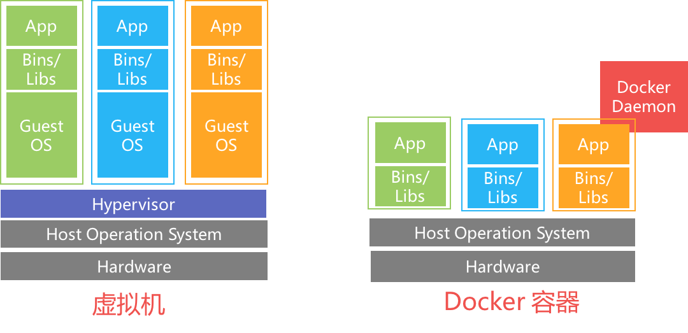

# 容器简介
## 什么是容器
容器是一种轻量级的虚拟化技术，它在进程级别对CPU、内存、文件系统、网络IO等资源进行隔离。对比虚拟机通过容器，用户可以方便的将程序代码、配置以及运行环境进行打包，快速的运行在不同的操作系统上。

# Docker快速使用手册

您可以在 http://dockone.io/article/101 和 https://docs.docker.com 找到更加丰富的文档，以下文档会提供快速使用docker的一些基本操作说明。

## 安装Docker
Docker已经可以安装在Linux, Mac OS, Windows主流操作系统上。为了开发者可以使用本机安装的Docker完成开发，调试等工作。以下的链接给出了在本地安装Docker的方法：
* [在mac上安装Docker](https://docs.docker.com/docker-for-mac/install/)
* [在Windows上安装Docker](https://docs.docker.com/docker-for-windows/install/)
* [在Linux上安装Docker](https://docs.docker.com/engine/installation/) 在连接中的Linux发行版列表中选择对应您的发行版，查看对应的安装方法。

## Docker镜像
使用下面的命令可以从官方dockerhub下载`nginx`这个镜像，并且列出本地已下载的镜像
```bash
# docker pull nginx
# docker images
REPOSITORY                       TAG                            IMAGE ID            CREATED             SIZE
nginx                            latest                         5766334bdaa0        10 days ago         183 MB
```

## 使用Docker容器

### 启动交互式容器
可以通过下面的命令，创建并启动一个容器。其中参数`-it`说明以交互式方式启动容器；`nginx`是从这个镜像启动容器；`/bin/bash`指启动容器后执行的命令。
```bash
# docker run -it nginx /bin/bash
root@732648fa62f8:/# ls
bin  boot  dev	etc  home  lib	lib64  media  mnt  opt	proc  root  run  sbin  srv  sys  tmp  usr  var
```
执行成功，可以看到进入一个命令行环境，用户是root，说明已经在容器中了。此时可以

下面命令使用刚才`docker pull nginx`所下载的`nginx`镜像启动了一个可以交互式访问的容器，和使用Linux操作相同。此时输入`exit`可以退出这个docker容器。
由于每个容器是为了运行程序而启动的，而我们刚才运行的程序世纪上就是bash解释器`/bin/bash`，所以在执行`exit`退出bash后，这个程序也退出了

```
# docker ps -a
CONTAINER ID        IMAGE               COMMAND                  CREATED             STATUS                          PORTS               NAMES
732648fa62f8        nginx               "/bin/bash"              3 minutes ago       Exited (0) About a minute ago                       youthful_dubinsky
```
可以看到容器的状态为"Exited (0) About a minute ago"。表示以返回值0退出。`docker ps -a`中`-a`参数是指查看所有容器，包括正在运行的和已经退出的。
此时执行：
```
docker rm youthful_dubinsky
```
可以删除掉这个容器。

### 使用容器启动任务／服务

使用下面的命令在容器中启动一个nginx服务，并监听在`8000`端口；容器启动后使用`docker ps`可以查看到正在运行的容器。
```
# docker run -d -p 8000:80 nginx
46c79f420a7c5e5e282d5a07cf7d4666cfc69647d9204f1e486dbf16766f674c
# docker ps
CONTAINER ID        IMAGE               COMMAND                  CREATED             STATUS              PORTS                           NAMES
46c79f420a7c        nginx               "nginx -g 'daemon ..."   3 seconds ago       Up 2 seconds        443/tcp, 0.0.0.0:8000->80/tcp   peaceful_euclid
```

其中`-d`参数指定容器以后台方式运行。`-p`指定将nginx在容器内启动的80端口绑定到主机的8000端口。

更多关于`docker run`的细节，可以参考[这里](https://docs.docker.com/engine/reference/run/)

### 使用Dockerfile制作自己的镜像

一个Dockerfile的例子，这个文件在：https://github.com/k8sp/tutorials/blob/develop/quickstart/paddle_dist_train/Dockerfile
```Dockerfile
FROM paddlepaddle/paddle:0.10.0rc2
ADD start.sh start_paddle.py get_data.sh fetch_trainerid.py /root/
ADD ./quick_start /root/quick_start
CMD ["bash","/root/start.sh"]
```

- `FROM`行指定基于`paddlepaddle/paddle:0.10.0rc2`这个镜像之上增加以下自己的操作，而这个基础镜像已经包含了paddle的二进制和运行环境
- `ADD`两行将当前目录的一些脚本文件添加到要制作的Docker镜像中。这样在制作的镜像中就会包含这些文件
- `CMD`定义镜像默认的启动命令

执行下面的命令开始编译Docker镜像。其中`-t cluster_train`指定编译这个镜像的路径(cluster_train)和TAG(1.0)。最后的`.`表示编译上下文为当前路径。
```
docker build -t cluster_train:1.0 .
```

## 容器与虚拟机的对比
容器是在进程级别对资源进行隔离，而虚拟机是对操作系统进行资源隔离，很多时候我们只是需要运行一个进程来处理我们的业务，而不需要启动整个操作系统，下面一张经典的对比图：



特性|虚拟机|容器
--- | --- | ---
安全性|高|较高
隔离性|高|较高
性能|低|高
资源伸缩|重启虚拟机|重启进程
虚拟化粒度|主机级|进程级
镜像体积|大|小

## 容器发展的主要里程碑
容器技术的发展历程基本上是从著名的[Chroot](https://en.wikipedia.org/wiki/Chroot)项目开始，经过诸多项目的历练，在2013年，出现了广为人知的[Docker](https://www.docker.com)。

- **1979: Unix V7**

  在1979年，Unix V7 引入了一个被称为[Chroot](https://en.wikipedia.org/wiki/Chroot)的系统，并在1982年被添加到BSD中.[Chroot](https://en.wikipedia.org/wiki/Chroot)会在文件系统中创建一个新的目录，作为进程的根目录，这一特性使得不同进程拥有自己的目录权限，实现了文件系统上的隔离。
- **2000: FreeBSD Jail && Linux VServer**

  在2000年左右，出现了FressBSD Jail系统，它允许管理员将FreeBSD的系统分割成几个被称为Jails的独立系统，并且这些小系统拥有了独立的IP地址。
- **2001: Linux VServer**

  基于FreeBSD Jails，出现了[Linux VServer](https://en.wikipedia.org/wiki/Linux-VServer)，它可以在服务器上划分资源(文件系统，网络地址以及内存资源)，更加丰富了到2006年它出现在了Linux kernel的stable版本中。
- **2004~2005**

  在2004~2005年期间，出现了很多基于Linux的容器技术，例如2004年的[Solaris containers](https://en.wikipedia.org/wiki/Solaris_Containers)以及出现在2005年左右的[OpenVZ](https://en.wikipedia.org/wiki/OpenVZ)。
- **2006: Process Containers**

  Google凭借Process Contianers进入容器界，它在进程基础上对CPU，内存，磁盘IO以及网络IO资源做了限制，审计和隔离。这些特性在一年以后被加入到Linux kernel 2.6.24，并更名为**Control Groups(cgroups)** ，值得一提的是在现在的Docker版本中依然使用着cgroups技术。

- **2008: LXC**

  LXC整合了Linux Kernel中cgroups和namespace，是一种轻量级的虚拟化技术，缺点是使用过于复杂。
- **2011: Warden**

  warden支持运行在多种操作系统上，并且作为一个daemon进程运行的系统上，提供了API接口来管理系统上的容器。
- **2013: Docker**
  由于LXC的使用过于复杂，出现了Docker技术，它基于LXC封装了自己的指令体系，使其变得更为易用.Docker能够得到如此广泛认可，也得益于它可以让开发人员快速的部署，运行容器.配合Docker Hub使用，开发人员可以快速的在任何有互联网连接的地方将应用启动。


## 参考文献
- [A Brief History of Containers: From 1970s chroot to Docker 2016](http://blog.aquasec.com/a-brief-history-of-containers-from-1970s-chroot-to-docker-2016)
- [Docker docs](https://docs.docker.com)
- [What are Containers](https://aws.amazon.com/containers/)
