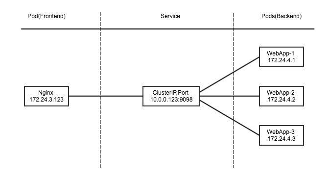

# Service的网络模型
在Kubernetes中Servie是一种抽象资源类型，在逻辑上通过[Label selectors](https://kubernetes.io/docs/user-guide/labels/#label-selectors)的机制定义了一组Pod以及对这一组Pod的访问方式。

## 为什么要有Service
在Kubernetes的Node上，Pod的IP地址是被动态分配在**docker0**所在网段的,当发生重启，扩容等操作时，IP地址会随之变化。当某个Pod(frontend)需要去访问其依赖的另外一组Pod(backend)时，如果backend的IP发生变化时，如何保证fronted到backend的正常通信变的非常重要。为了解决此类问题,Kubernetes设计了Service的概念。

在实际生产环境中，对Service的访问可能会有两种来源：
- Kubernetes集群内部的程序（Pod)
- Kubernetes集群外部的流量

为了满足上述的场景，Service有以下三种类型：

* **ClusterIP**:提供一个集群内部的虚拟IP以供Pod访问。
* **NodePort**:在每个Node上打开一个端口以供外部访问。
* **LoadBalancer**:在某几个node上开放端口，并通过负载均衡器来供外部访问。

### ClusterIP

此模式会提供一个集群内部的虚拟IP（与Pod不在同一网段)，以供集群内部的pod之间通信使用。

ClusterIP也是Kubernetes service的默认类型。



为了实现图上的功能主要需要以下几个组件的协同工作

* **apiserver** 用户通过kubectl命令向apiserver发送创建service的命令，apiserver接收到请求以后将数据存储到etcd中。
* **kube-proxy** kubernetes的每个节点中都有一个叫做kube-proxy的进程，这个进程负责感知service，pod的变化，并将变化的信息写入本地的iptables中。
* **iptables** 使用NAT等技术将virtualIP的流量转至endpoint中。

下面我们实际发布一个Service，能够更清晰的了解到Service是如何工作的。

  * 发布一组Pod

    我们定义一个个[ReplicationController](https://kubernetes.io/docs/user-guide/replication-controller/)(RC)来启动一组Pod，并过将`replices count`设为3，来启动3个Pod。

    ```bash
    yancey@ yancey-macbook kubernetes-1$kubectl create -f nginx-replication-controller.yaml
    ```

  * 发布一个service
    ```bash
    yancey@ yancey-macbook kubernetes-1$kubectl create -f ./nginx-service.yaml
    yancey@ yancey-macbook kubernetes-1$kubectl get svc
    NAME            CLUSTER-IP   EXTERNAL-IP   PORT(S)    AGE
    kubernetes      10.0.0.1     <none>        443/TCP    9m
    nginx-service   10.0.0.252   <none>        8000/TCP   4m
    ```
    能够看到Kubernetes为名尾nginx-service的Service创建了一个clusterIP,地址为10.0.0.252.

    在本文开头处提到每个Service定义了的一组逻辑上的Pod,他们的IP地址称为**endpoint**,通过`get endpoint`命令能够看到这一组endpoint的IP地址,分别对应了nginx的三个Pod的IP。
    ```bash
    yancey@ yancey-macbook kubernetes-1$kubectl get endpoint
    NAME            ENDPOINTS                                AGE
    kubernetes      172.17.8.101:6443                        9m
    nginx-service   10.1.13.2:80,10.1.13.3:80,10.1.13.4:80   4m
    ```

  * 查看iptables，观察其NAT表中的信息（只截取了部分和这个service有关的信息）
    查看iptables中NAT表的命令:```iptables -L -v -n -t nat```

    ```bash
    Chain PREROUTING (policy ACCEPT 0 packets, 0 bytes)
     pkts bytes target     prot opt in     out     source               destination
       37  2766 KUBE-SERVICES  all  --  *      *       0.0.0.0/0            0.0.0.0/0            /* kubernetes service portals */
       33  2112 DOCKER     all  --  *      *       0.0.0.0/0            0.0.0.0/0            ADDRTYPE match dst-type LOCAL
    ```
    在PREROUTING链中会先匹配到KUBE-SERVICES这个Chain。

    ```bash
    Chain KUBE-SERVICES (2 references)
     pkts bytes target     prot opt in     out     source               destination
        0     0 KUBE-SVC-GKN7Y2BSGW4NJTYL  tcp  --  *      *       0.0.0.0/0            10.0.0.252           /* default/nginx-service: cluster IP */ tcp dpt:8000
       18  1080 KUBE-NODEPORTS  all  --  *      *       0.0.0.0/0            0.0.0.0/0            /* kubernetes service nodeports; NOTE: this must be the last rule in this chain */ ADDRTYPE match dst-type LOCAL

    ```
    所有destinationIP为10.0.0.252的包都转到**KUBE-SVC-GKN7Y2BSGW4NJTYL**这个Chain

    ```bash
    Chain KUBE-SVC-GKN7Y2BSGW4NJTYL (1 references)
     pkts bytes target     prot opt in     out     source               destination
        0     0 KUBE-SEP-7ROBBXFV7SD4AIRW  all  --  *      *       0.0.0.0/0            0.0.0.0/0            /* default/nginx-service: */ statistic mode random probability 0.33332999982
        0     0 KUBE-SEP-XY3F6VJIZ7ELIF4Z  all  --  *      *       0.0.0.0/0            0.0.0.0/0            /* default/nginx-service: */ statistic mode random probability 0.50000000000
        0     0 KUBE-SEP-JIDZHFC4A3T535AK  all  --  *      *       0.0.0.0/0            0.0.0.0/0            /* default/nginx-service: */
    ```
    这里能看到数据包会以相等概率分配到**KUBE-SEP-7ROBBXFV7SD4AIRW**,**KUBE-SEP-XY3F6VJIZ7ELIF4Z**,**KUBE-SEP-XY3F6VJIZ7ELIF4Z**这三个Chain.最后我们看下**KUBE-SEP-7ROBBXFV7SD4AIRW**这个Chain做了什么

    ```
    Chain KUBE-SEP-7ROBBXFV7SD4AIRW (1 references)
     pkts bytes target     prot opt in     out     source               destination
        0     0 KUBE-MARK-MASQ  all  --  *      *       10.1.13.2            0.0.0.0/0            /* default/nginx-service: */
        0     0 DNAT       tcp  --  *      *       0.0.0.0/0            0.0.0.0/0            /* default/nginx-service: */ tcp to:10.1.13.2:80

    ```
    这个Chain使用了DNAT规则将流量转发到10.1.13.2:80这个地址。至此从Pod发出来的流量通过本地的iptables将流量转至了service背后的pod上。

### NodePort
  Kubernetes将会在每个Node上打开一个端口并且**每个Node的端口都是一样的**，通过\<NodeIP>:NodePort的方式Kubernetes集群外部的程序可以访问Service。

  修改./nginx-service.yaml，将Service的type改为NodePort类型。

  ```
  apiVersion: v1
  kind: Service
  metadata:
    name: nginx-service
  spec:
    type: NodePort
    ports:
    - port: 8000
      targetPort: 80
      protocol: TCP
    # just like the selector in the replication controller,
    # but this time it identifies the set of pods to load balance
    # traffic to.
    selector:
      app: nginx
  ```
  发布这个service，在这里targetPort指的是Pod对外开放的端口，port指的是service对外的端口.

  ```
  yancey@ yancey-macbook kubernetes-1$kubectl get svc nginx-service -o yaml
  apiVersion: v1
  kind: Service
  metadata:
    creationTimestamp: 2016-06-18T03:29:42Z
    name: nginx-service
    namespace: default
    resourceVersion: "1405"
    selfLink: /api/v1/namespaces/default/services/nginx-service
    uid: e50ba23a-3504-11e6-a94f-080027a75e9e
  spec:
    clusterIP: 10.0.0.229
    ports:
    - nodePort: 30802
      port: 8000
      protocol: TCP
      targetPort: 80
    selector:
      app: nginx
    sessionAffinity: None
    type: NodePort
  status:
    loadBalancer: {}
  ```
  通过查看这个svc，发现已经自动分配了nodePort的端口，这个端口是node对外开放的端口

  观察Iptables中的变化，新增了KUBE-NODEPORTS这个Chain,并拥有以下两条规则:
  ```
  Chain KUBE-NODEPORTS (1 references)
  pkts bytes target     prot opt in     out     source               destination
    0     0 KUBE-MARK-MASQ  tcp  --  *      *       0.0.0.0/0            0.0.0.0/0            /* default/nginx-service: */ tcp dpt:30802
    0     0 KUBE-SVC-GKN7Y2BSGW4NJTYL  tcp  --  *      *       0.0.0.0/0            0.0.0.0/0            /* default/nginx-service: */ tcp dpt:30802
  ```
  可以看到流量会转至KUBE-SVC-GKN7Y2BSGW4NJTYL这个Chain中处理一次，也就是ClusterIP中提到的通过负载均衡将流量平均分配到3个endpoint上。

### LoadBalancer

  待补充

## 服务发现
  当发布一个服务之后，我们要使用这个服务，第一个问题就是要拿到这些服务的IP和PORT，kubernetes提供两种方式以便在程序中去动态的获取这些信息。

  * ENV环境变量

    在Pod其中之后，kubernetes会将现有服务的IP，PORT以环境变量的方式写入pod中，程序只要读取这些环境变量即可。
  * DNS

    程序中可以使用server的名称对服务进行访问，在程序启时候，不必预先读取环境变量中的内容。

  这是两种方式的详细说明：[http://kubernetes.io/docs/user-guide/services/#discovering-services](http://kubernetes.io/docs/user-guide/services/#discovering-services)

## 参考文献
  1. [iptables文档](https://access.redhat.com/documentation/en-US/Red_Hat_Enterprise_Linux/4/html/Security_Guide/s1-fireall-ipt-act.html#s2-firewall-policies)
  2. [Debuging Service](http://kubernetes.io/docs/user-guide/debugging-services/)
